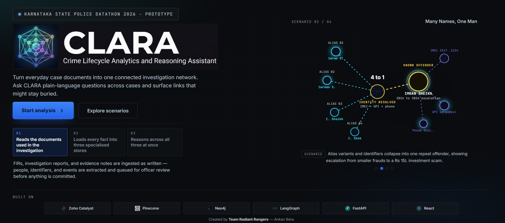

# KSP Crime Intelligence Platform

Karnataka State Police Datathon 2026 demo: upload FIR / investigation evidence, extract and link entities across Postgres, Neo4j, and Pinecone, and investigate with the CLARA assistant — all on Zoho Catalyst (AppSail + Job Functions) with Zoho QuickML for ingestion and chat.



---

## Repo layout

| Path | Role |
|------|------|
| `backend/` | FastAPI API, WebSockets, assistant |
| `frontend/` | React + Vite demo UI |
| `catalyst_functions/ingest_processor/` | Catalyst job: Phase A extract → Phase B load |
| `data_generation/` | Offline synthetic dataset builder |
| `data_ingestion/` | Historical load helpers (Stratus / stores) |
| `sample_data/` | Generated historical + live-demo documents |
| `scripts/` | Wipe / reload historical data, demo reset |

Package notes: [backend/README.md](backend/README.md) · [frontend/README.md](frontend/README.md) · [ingest_processor/README.md](catalyst_functions/ingest_processor/README.md)

---

## Prerequisites

- Python 3.11+
- Node.js 20+
- Docker Desktop (for AppSail image builds)
- [Zoho Catalyst CLI](https://www.zoho.com/catalyst/help/cli.html) (`npm i -g zcatalyst-cli` or use the root `package.json`)
- Accounts / projects: Zoho Catalyst (India DC), Postgres, Neo4j Aura, Pinecone

---

## 1. Clone and install

```powershell
cd C:\path\to\ksp_datathon_26

# Python (data generation + backend + local scripts)
python -m venv .venv
.\.venv\Scripts\Activate.ps1
pip install -r requirements.txt
pip install -r backend/requirements.txt

# Frontend
cd frontend
npm install
cd ..

# Catalyst CLI (optional if already global)
npm install
```

---

## 2. Environment variables

Copy the examples and fill in real values. **Do not commit real `.env` / config files.**

```powershell
# Backend + local scripts (repo root)
copy .env.example .env

# Frontend
copy frontend\.env.example frontend\.env

# Catalyst project file (used by CLI deploy)
copy catalyst.example.json catalyst.json

# Ingest job function env (baked into function deploy config)
copy catalyst_functions\ingest_processor\catalyst-config.example.json catalyst_functions\ingest_processor\catalyst-config.json
```

Both **data ingestion** and **chat** use Zoho QuickML:

```env
DATA_INGESTION_LLM=zoho
CHAT_LLM_PROVIDER=zoho
```

Set the India DC overrides and Zoho OAuth / QuickML vars as documented in `.env.example`. Also set `DB_*`, `NEO4J_*`, `PINECONE_*`, and matching values in `catalyst-config.json` for the job function.

Local ingest without submitting Catalyst jobs:

```env
INGEST_LOCAL_INVOKE=true
```

For AppSail / remote jobs, set `INGEST_LOCAL_INVOKE=false` and point `SPLINK_ENDPOINT_URL` at your deployed backend base URL.

---

## 3. Generate sample data (optional)

`sample_data/` is already in the repo. Regenerate only if you change the generator:

```powershell
python -m data_generation.generate
python -m data_generation.validate --output-dir sample_data
```

Outputs land under `sample_data/historical/` (pre-load baseline) and `sample_data/live_demo/` (upload targets for demo scenarios).

---

## 4. Load historical data into stores

Wipe all stores and reload the historical baseline from `sample_data` + sqlite:

```powershell
# Dry-run (prints the plan)
python scripts/reset_and_reload_historical.py

# Execute
python scripts/reset_and_reload_historical.py --yes
```

This runs: wipe → Postgres migrate → historical docs to Stratus → Neo4j → Pinecone.

Demo-only wipe (keeps historical seed):

```powershell
python scripts/reset_demo_data.py --dry-run
python scripts/reset_demo_data.py --yes
```

---

## 5. Run locally

**Backend** (port 9000):

```powershell
uvicorn app.main:app --app-dir backend --reload --host 0.0.0.0 --port 9000
```

**Frontend** (Vite; proxies `/api` and `/ws` when `VITE_API_BASE_URL` is unset):

```powershell
cd frontend
npm run dev
```

Open the Vite URL shown in the terminal. Smoke: `http://localhost:9000/healthz`.

---

## 6. Deploy to Zoho Catalyst

Login to the **India** data centre, then deploy AppSail apps and the ingest function.

### 6.1 Docker Hub images

Build and push backend + frontend images to **Docker Hub** (replace `YOUR_DOCKERHUB_USER`):

```powershell
cd C:\path\to\ksp_datathon_26

# Backend
docker build -f backend/Dockerfile.appsail -t YOUR_DOCKERHUB_USER/ksp-catalyst-backend:latest .
docker push YOUR_DOCKERHUB_USER/ksp-catalyst-backend:latest

# Frontend — set BACKEND_URL / VITE_WS_BASE_URL to your live backend origin before/during build
docker build -f frontend/Dockerfile.appsail -t YOUR_DOCKERHUB_USER/ksp-catalyst-frontend:latest .
docker push YOUR_DOCKERHUB_USER/ksp-catalyst-frontend:latest
```

Ensure `catalyst.json` and `catalyst_functions/ingest_processor/catalyst-config.json` have production env values (Zoho LLM, DB, Neo4j, Pinecone, Splink URL). Images that `COPY .env` must not ship secrets you are unwilling to publish — prefer AppSail / portal env where possible.

### 6.2 AppSail (backend + frontend)

```powershell
catalyst login

catalyst deploy appsail --name ksp-catalyst-backend --source docker://YOUR_DOCKERHUB_USER/ksp-catalyst-backend:latest --port 9000

catalyst deploy appsail --name ksp-catalyst-frontend --source docker://YOUR_DOCKERHUB_USER/ksp-catalyst-frontend:latest --port 9000
```

### 6.3 Ingest job function

```powershell
# Ensure catalyst.json functions.targets includes "ingest_processor"
# and catalyst-config.json env_variables are filled in
catalyst deploy --only functions:ingest_processor
```

CLI deploys can sit with little terminal output while Catalyst works — wait and confirm in the Catalyst console rather than killing the command early.

---

## Demo scenarios (after historical load)

Allowlisted keys: `digital-arrest`, `many-names`, `follow-money`, `surge`.

Typical API flow:

1. `POST /api/v1/demo-scenarios/{scenario_key}/prepare`
2. `POST /api/v1/upload` (FIR, then IR / evidence)
3. `POST /api/v1/process/{batch_id}` → Phase A → `REVIEW_PENDING`
4. Resolve review queue if needed
5. `POST /api/v1/process/{run_id}/proceed` → Phase B → `COMPLETED`

Live documents for the UI live under `frontend/src/assets/live_demo/` (synced from `sample_data/live_demo/`).

---

## Notes

- Refresh token scopes must include Catalyst project, Stratus, QuickML, and job scheduling APIs.
- Postgres via a transaction pooler needs `prepare_threshold=0` (already wired in app connection strings).
- Secret-bearing files (`catalyst.json`, `catalyst-config.json`, `.env`) are gitignored; only the `*.example*` templates are tracked.
